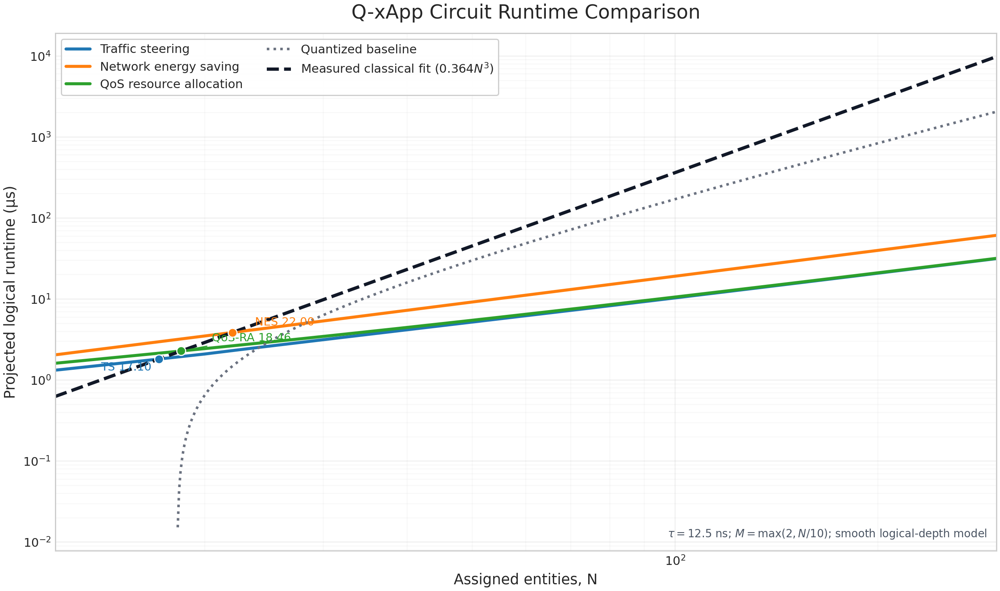

# 10. Complexity

This section derives the logical depth, workspace, and projected runtime of the Q-xApp circuits for traffic steering (TS), network energy saving (NES), and QoS-based resource allocation (QoS-RA). Each application is decomposed into common counting, comparison, control-aggregation, utility-marking, and reflection operations. The common operation costs are established first and then instantiated for the three circuits.

## 10.1 Complexity model and notation

Let $N$ denote the number of entities being assigned, $M$ the number of candidate O-RUs, and $R$ the number of candidate DRBs. The address and population-register widths are

$$
k=\left\lceil\log_2M\right\rceil,
\qquad
w=\left\lceil\log_2(N+1)\right\rceil.
$$

All logarithms are base 2. For the TS runtime curves, the number of candidate O-RUs follows

$$
M=\max\left(2,\frac{N}{10}\right).
$$

The logical runtime of application $a\in\{\mathrm{TS},\mathrm{NES},\mathrm{QoS}\}$ is evaluated as

$$
t_a(N;\tau)=\tau D_a(N),
$$

where $D_a(N)$ is the scheduled non-Clifford depth of one complete circuit evaluation and $\tau$ is the effective logical-layer latency. Two timing regimes are considered:

<table border="1" cellspacing="0" cellpadding="6">
  <thead>
    <tr>
      <th>Timing regime</th>
      <th>Logical-layer latency</th>
      <th>Purpose</th>
    </tr>
  </thead>
  <tbody>
    <tr>
      <td>Baseline</td>
      <td>$\tau_{\mathrm{base}}=50\,\mathrm{ns}$</td>
      <td>Conservative logical-runtime projection</td>
    </tr>
    <tr>
      <td>Enhanced</td>
      <td>$\tau_{\mathrm{enh}}=12.5\,\mathrm{ns}$</td>
      <td>Fourfold improvement from faster logical layers and scheduling</td>
    </tr>
  </tbody>
</table>

## 10.2 Common depth and workspace terms

### Population counting

A population constraint counts the $N$ assignment predicates associated with one resource. The selected arithmetic schedule uses a controlled carry-lookahead increment over the $w$-bit counter. Its smoothed per-update depth is

$$
L(w)=\log_2w+1.
$$

The $N$ UE updates within one resource lane act on the same counter and therefore remain sequential. Including computation and uncomputation, one population pass contributes

$$
\begin{aligned}
P(N)
&=2N L\!\left(\log_2(N+1)\right)\\
&=2N\left[\log_2\!\left(\log_2(N+1)\right)+1\right]\\
&=O(N\log\log N).
\end{aligned}
$$

Resource constraints use independent counters and can be scheduled in parallel. The factor $M$ therefore moves from the critical-path depth to the workspace: TS requires $O(M\log N)$ counter and carry ancillas, while the corresponding QoS-RA extension requires $O(R\log N)$.

The width--depth alternatives are summarized below.

<table border="1" cellspacing="0" cellpadding="6">
  <thead>
    <tr>
      <th>Counter organization</th>
      <th>Population depth</th>
      <th>Workspace</th>
      <th>Role</th>
    </tr>
  </thead>
  <tbody>
    <tr>
      <td>Globally reused ripple counter</td>
      <td>$O(MN\log N)$</td>
      <td>$O(\log N)$</td>
      <td>Minimum-width organization</td>
    </tr>
    <tr>
      <td>Resource-local ripple counters</td>
      <td>$O(N\log N)$</td>
      <td>$O(M\log N)$</td>
      <td>Parallel resource constraints</td>
    </tr>
    <tr>
      <td>Resource-local carry-lookahead counters</td>
      <td>$O(N\log\log N)$</td>
      <td>$O(M\log N)$</td>
      <td>Schedule used in the runtime curves</td>
    </tr>
    <tr>
      <td>Full UE population tree</td>
      <td>$O(\log^2N)$</td>
      <td>$O(MN)$</td>
      <td>Not used because of its linear-per-resource workspace</td>
    </tr>
  </tbody>
</table>

### Comparison, control, and reflection

The remaining circuit components grow logarithmically with their control or register widths. Under balanced relative-phase Toffoli decomposition,

$$
\Delta_r\simeq2\left\lceil\log_2r\right\rceil
$$

for an $r$-controlled logical operation, and a reversible comparison over the population register contributes

$$
D_{\mathrm{cmp}}(w)\simeq2w.
$$

The common contributions used in the application equations are

<table border="1" cellspacing="0" cellpadding="6">
  <thead>
    <tr>
      <th>Operation</th>
      <th>Depth contribution</th>
      <th>Asymptotic order</th>
    </tr>
  </thead>
  <tbody>
    <tr>
      <td>One computed-and-cleared population pass</td>
      <td>$P(N)$</td>
      <td>$O(N\log\log N)$</td>
    </tr>
    <tr>
      <td>Population comparison</td>
      <td>$2w$</td>
      <td>$O(\log N)$</td>
    </tr>
    <tr>
      <td>Balanced $r$-control aggregation</td>
      <td>$2\lceil\log_2r\rceil$</td>
      <td>$O(\log r)$</td>
    </tr>
    <tr>
      <td>Assignment-register reflection</td>
      <td>$2\log_2(Nk-1)+O(1)$</td>
      <td>$O(\log N+\log\log M)$</td>
    </tr>
  </tbody>
</table>

## 10.3 Application-specific circuit complexity

### Traffic steering

With $k=\log_2M$ in the smooth curve, the TS depth is

$$
\begin{aligned}
D_{\mathrm{TS}}(N)
={}&P(N)
+4\log_2 k
+2\log_2N
+2k\\
&+2\log_2(M+N)
+2\log_2(NM)\\
&+2\log_2(Nk-1)
+4.
\end{aligned}
$$

The first term counts and clears the resource populations. The remaining terms account for address matching, capacity comparison, aggregation of the constraint flags, utility control, and reflection over the assignment register. Since these additional terms are logarithmic,

$$
D_{\mathrm{TS}}(N)=O(N\log\log N).
$$

The corresponding runtime is

$$
t_{\mathrm{TS}}(N;\tau)=\tau D_{\mathrm{TS}}(N).
$$

### Network energy saving

The NES utility oracle evaluates the feasibility condition before utility marking and clears it after the phase operation. The two population passes give

$$
D_{\mathrm{NES}}(N)
=2P(N)
+4\log_2\log_2N
+2\log_2(N+1)
+2\log_2(N-1)
+4.
$$

Therefore,

$$
D_{\mathrm{NES}}(N)=O(N\log\log N),
\qquad
t_{\mathrm{NES}}(N;\tau)=\tau D_{\mathrm{NES}}(N).
$$

The factor $2P(N)$ explains why NES has the largest constant among the three Q-xApp curves even though their asymptotic orders are identical.

### QoS-based resource allocation

For the scaling model, the numbers of UEs and candidate DRBs increase together, so that $R=N$. Parallel DRB-local occupancy checks and the utility controls give

$$
D_{\mathrm{QoS}}(N)
=P(N)
+4\log_2\log_2N
+10\log_2N
+2\log_2\!\left(N\log_2N-1\right)
+6.
$$

Thus,

$$
D_{\mathrm{QoS}}(N)=O(N\log\log N),
\qquad
t_{\mathrm{QoS}}(N;\tau)=\tau D_{\mathrm{QoS}}(N).
$$

The three circuit results are summarized as follows.

<table border="1" cellspacing="0" cellpadding="6">
  <thead>
    <tr>
      <th>Application</th>
      <th>Population contribution</th>
      <th>Overall depth</th>
      <th>Distinguishing operation</th>
    </tr>
  </thead>
  <tbody>
    <tr>
      <td>TS</td>
      <td>$P(N)$</td>
      <td>$O(N\log\log N)$</td>
      <td>O-RU address matching and capacity aggregation</td>
    </tr>
    <tr>
      <td>NES</td>
      <td>$2P(N)$</td>
      <td>$O(N\log\log N)$</td>
      <td>Feasibility evaluation on both sides of utility marking</td>
    </tr>
    <tr>
      <td>QoS-RA</td>
      <td>$P(N)$</td>
      <td>$O(N\log\log N)$</td>
      <td>DRB occupancy and utility controls with $R=N$</td>
    </tr>
  </tbody>
</table>

## 10.4 Comparison runtime models

The Q-xApp curves are compared with the earlier quantized assignment model and with cubic classical assignment references.

The quantized runtime trendline is

$$
t_{\mathrm{quant}}(N)
=9.98N^2
\log_2\!\left(\log_2\frac{N}{10}\right)
-27.4N+1196
\quad\mathrm{ns},
$$

which has dominant growth $O(N^2\log\log N)$.

For the cubic classical comparison, the historical CQF curve is

$$
t_{\mathrm{class,hist}}(N)=0.182N^3
\quad\mathrm{ns}.
$$

The coefficient $0.182$ is the historical empirical reference and is independent of the quantum timing model. The current crossover comparison additionally uses

$$
t_{\mathrm{class,rep}}(N)=0.364N^3
\quad\mathrm{ns}.
$$

The coefficient $0.364$ is not obtained by replacing $N$ columns with $2N$ columns and is not an algebraic doubling of $0.182$. It is selected as a representative intermediate coefficient between the measured continuous-cost and tie-heavy dense assignment profiles. The corresponding cubic-through-origin fits were approximately $0.0588N^3$ and $0.741N^3$, respectively. The representative curve also accommodates the extra bounded-assignment work associated with physical constraints and dummy-resource handling without claiming a machine-independent constant.

<table border="1" cellspacing="0" cellpadding="6">
  <thead>
    <tr>
      <th>Comparison curve</th>
      <th>Runtime model (ns)</th>
      <th>Growth</th>
      <th>Use in this section</th>
    </tr>
  </thead>
  <tbody>
    <tr>
      <td>Quantized assignment</td>
      <td>$9.98N^2\log_2\!\log_2(N/10)-27.4N+1196$</td>
      <td>$O(N^2\log\log N)$</td>
      <td>Earlier quantized baseline</td>
    </tr>
    <tr>
      <td>Historical classical fit</td>
      <td>$0.182N^3$</td>
      <td>$O(N^3)$</td>
      <td>Original CQF reference</td>
    </tr>
    <tr>
      <td>Representative classical fit</td>
      <td>$0.364N^3$</td>
      <td>$O(N^3)$</td>
      <td>Primary crossover reference</td>
    </tr>
  </tbody>
</table>

## 10.5 Crossover analysis

The crossover satisfies

$$
\tau D_a(N)=\alpha N^3,
$$

where $\alpha\in\{0.182,0.364\}$ and $a\in\{\mathrm{TS},\mathrm{NES},\mathrm{QoS}\}$. Solving the smooth equations gives the following continuous intersections.

<table border="1" cellspacing="0" cellpadding="6">
  <thead>
    <tr>
      <th>Logical latency</th>
      <th>Classical coefficient</th>
      <th>TS crossover</th>
      <th>NES crossover</th>
      <th>QoS-RA crossover</th>
    </tr>
  </thead>
  <tbody>
    <tr>
      <td>$50\,\mathrm{ns}$</td>
      <td>$0.182$</td>
      <td>$N\simeq47.85$</td>
      <td>$N\simeq64.11$</td>
      <td>$N\simeq49.15$</td>
    </tr>
    <tr>
      <td>$50\,\mathrm{ns}$</td>
      <td>$0.364$</td>
      <td>$N\simeq33.95$</td>
      <td>$N\simeq44.87$</td>
      <td>$N\simeq35.29$</td>
    </tr>
    <tr>
      <td>$12.5\,\mathrm{ns}$</td>
      <td>$0.182$</td>
      <td>$N\simeq24.06$</td>
      <td>$N\simeq31.41$</td>
      <td>$N\simeq25.46$</td>
    </tr>
    <tr>
      <td>$12.5\,\mathrm{ns}$</td>
      <td>$0.364$</td>
      <td>$N\simeq17.10$</td>
      <td>$N\simeq22.00$</td>
      <td>$N\simeq18.46$</td>
    </tr>
  </tbody>
</table>

Under the enhanced latency and the representative classical coefficient, the first strict integer advantages occur at $N=18$ for TS, $N=23$ for NES, and $N=19$ for QoS-RA. At these points, the modeled runtimes are

<table border="1" cellspacing="0" cellpadding="6">
  <thead>
    <tr>
      <th>Application</th>
      <th>First integer advantage</th>
      <th>Q-xApp runtime</th>
      <th>Classical runtime</th>
    </tr>
  </thead>
  <tbody>
    <tr>
      <td>TS</td>
      <td>$N=18$</td>
      <td>$1.908\,\mu\mathrm{s}$</td>
      <td>$2.123\,\mu\mathrm{s}$</td>
    </tr>
    <tr>
      <td>NES</td>
      <td>$N=23$</td>
      <td>$4.061\,\mu\mathrm{s}$</td>
      <td>$4.429\,\mu\mathrm{s}$</td>
    </tr>
    <tr>
      <td>QoS-RA</td>
      <td>$N=19$</td>
      <td>$2.346\,\mu\mathrm{s}$</td>
      <td>$2.497\,\mu\mathrm{s}$</td>
    </tr>
  </tbody>
</table>

The baseline latency combined with the historical coefficient places the crossovers at approximately 48--64 UEs. Reducing the logical-layer latency to $12.5\,\mathrm{ns}$ moves the historical-reference intersections to approximately 24--31 UEs. Using the representative $0.364N^3$ reference shifts them further to approximately 17--22 UEs. The model therefore places the expected transition in the 20--30 UE range under enhanced logical hardware, with the exact intersection determined by the application and the selected empirical classical reference.

The logarithmic-depth arithmetic used in the counting term follows T. G. Draper, S. A. Kutin, E. M. Rains, and K. M. Svore, [“A Logarithmic-Depth Quantum Carry-Lookahead Adder”](https://arxiv.org/abs/quant-ph/0406142), *Quantum Information and Computation*, vol. 6, no. 4--5, pp. 351--369, 2006. Controlled hard-coded increment and decrement operations are also discussed by E. Campbell, A. Khurana, and A. Montanaro, [“Applying Quantum Algorithms to Constraint Satisfaction Problems”](https://quantum-journal.org/papers/q-2019-07-18-167/), *Quantum*, vol. 3, p. 167, 2019.
